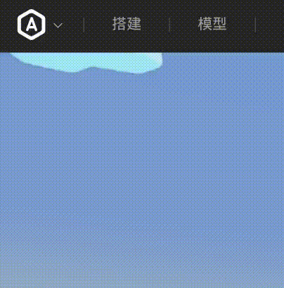

# 快速开始

这个教程适用于 [ArenaPro](https://docs.box3lab.com/arenapro/) 插件用户。在 [这里](#) 不能访问到还未编写的适用于 Web 开发的文档。

## 概览

MineMotion 是一个轻量级的动画库，可以用于创造各种动画效果。

## 应用实例

下面是使用了 Mine Motion 创建了动画效果的几个优秀作品：

- [Beyond Motion](https://dao3.fun/exp/experience/detail/100370966)：几个 Mine Motion 最基本的演示。
- [圈地之王：风云不测](https://dao3.fun/exp/experience/detail/100268076)：使用 Mine Motion 创建了高质量的新手教程。
- [Adaptive Chessboard Model](https://dao3.fun/exp/experience/detail/100372813)：使用 Mine Motion 创建了炫酷的 UI 动效。
- 下一个优质地图，由你创建。


## 安装

### 前置条件

* ArenaPro 插件
* Node.js v22 或更高版本

### 使用 ArenaPro 插件安装

1. 在 VScode 编辑器界面按下 `Ctrl + Shift + P` 打开命令面板
2. 搜索 `ArenaPro` 并运行 `ArenaPro: 查看神岛NPM包` 命令
3. 在弹出的输入框中搜索 `minemotion` 并点击
4. 在左下角弹窗中点击“确认安装”，等待 `minemotion` 安装

### 使用包管理器安装

在终端运行

::: code-group

```bash[npm]
npm install @dao3fun/mine-motion
```

```bash[yarn]
yarn install @dao3fun/mine-motion
```

```bash[pnpm]
pnpm install @dao3fun/mine-motion
```
:::

:::tip
如果你在中国大陆，可能需要配置换源。
:::

## 简单动画

下面示例展示如何创建一个简单动画：1 秒内将方块从 `(0, 0)` 移动到 `(100, 100)`。

首先，让我们创建一个红色的正方形：

```typescript
// 创建 UiScreen
const defaultScreen = UiScreen.create();

// 创建方块并初始化
const box = UiBox.create();
box.backgroundColor.r = 200;
box.size.offset.x = 100;
box.size.offset.y = 100;
box.parent = defaultScreen;
```

现在你应该会在画面中看到一个红色的正方形，并且它的位置为 `(0, 0)`。接下来，我们要使用 Mine Motion 让这个正方形动起来。

为了使用 Mine Motion，我们需要先导入 `MineMotion` 对象，用于调用 Mine Motion 库中的方法；以及 `MineEases`，里面包含了一些常用的动画缓动函数，可以让动画更加平滑。

```typescript
import { MineEases, MineMotion } from "@dao3fun/mine-motion";
```

接下来，我们使用 `MineMotion.animate` 来创建一个动画，并传入动画的关键帧数据。

```typescript
// 应用动画
MineMotion.animate(
  box.position.offset,    // 要改变的属性
  [                       // 关键帧数据
    { value: {x: 0, y: 0}, duration: 0 },
    { value: {x: 100, y: 100}, duration: 1000, ease: MineEases.easeInOut }
  ], 
  {                       // 动画配置 
    delay: 0,
    speed: 1
  }
)
```

效果演示如下（屏幕录制略有掉帧）


显然，最后几行代码是创建动画的关键。我们往 `MineMotion.animate` 里传入了三个参数：

- **目标对象**：要改变的属性（如位置、颜色）
- **关键帧数组**：动画路径点，每个包含：
  - `value`: 目标状态值
  - `duration`: 过渡时间(毫秒)
  - `ease`: 缓动函数(可选)
- **配置选项**：如延迟、速度等(可选)

:::tip 💡动画中的缓动函数：让运动更自然的魔法

#### 一、什么是缓动函数？
缓动函数（Easing Function）是动画中控制**运动速度变化规律**的数学函数。它决定了物体在动画过程中如何加速或减速，比如：
- 小球落地时先加速，弹起时减速
- 抽屉打开时先慢→快→慢

#### 二、为什么要用它？——打破"机器人式"动画
没有缓动函数的动画是**线性运动**（匀速），但现实世界中物体运动受惯性影响，因此线性运动看上去会比较生硬。下面是一个简单的对比，你可以通过鼠标悬浮或点击查看不同缓动函数带来的效果差异。

<style scoped>
  .box {
    width: 50px;
    height: 20px;
    position: relative;
    animation: 1s linear 0s infinite alternate paused mov;
  }

  .linear {
    background-color: #336699;
    animation-timing-function: linear;
  }

  .ease-in {
    background-color: #99cc33;
    animation-timing-function: ease-in;
  }

  .ease-out {
    background-color: #886666;
    animation-timing-function: ease-out;
  }

  .ease {
    background-color: #aaaa66;
    animation-timing-function: ease-in-out;
  }

  .column {
    display: flex;
    flex-direction: row;
    align-items: center;
    border-bottom: 1px solid #fcfcfc;
  }

  .column p {
    width: 100px;
    border-right: 1px solid #fcfcfc;
    padding: 10px;
  }

  .column:hover div {
    animation-play-state: running;
  }

  #easing-func-demo{
    border: 1px solid #fcfcfc;
    border-bottom: none;
  }

  @keyframes mov {
    0% { left: 0; }
    100% { left: 100px; }
  }
</style>

<div id="easing-func-demo">
  <div class="column">
    <p>线性动画</p>
    <div class="box linear"></div>
  </div>
  <div class="column">
    <p>缓入</p>
    <div class="box ease-in"></div>
  </div>
  <div class="column">
    <p>缓出</p>
    <div class="box ease-out"></div>
  </div>
  <div class="column">
    <p>缓入缓出</p>
    <div class="box ease"></div>
  </div>
</div>


通过缓动函数，动画会：
1. 更符合物理规律（如自由落体、弹簧振动）
2. 更引导用户注意力（如按钮点击的微交互）
3. 避免生硬的机械感（提升用户体验）

#### 三、常见类型与数学本质

1. **ease-in**：起步慢，后期猛（如汽车启动）

2. **ease-out**：起步猛，结尾稳（如刹车）

3. **ease-in-out**：慢→快→慢（如地铁进站）

4. 更多类型，由你自己设计。

#### 六、设计技巧：匹配场景
- **数据图表加载**：使用ease-out营造轻盈感
- **重要按钮点击**：轻微弹性反馈增强操作感
- **页面切换**：ease-in-out避免视觉跳跃

**关键理解**：缓动函数本质是通过**非线性时间映射**，在虚拟世界中重建真实世界的运动美感。就像导演用慢镜头控制观众情绪，开发者用缓动函数引导用户感知数字世界的"物理法则"。
:::

你可以试试改变上面例子中的一些参数具体的值，比如增加关键帧，改变缓动函数等，体会他们的作用。

## Timeline(时间轴)

Mine Motion 最核心的功能就在于 **Timeline**。使用 Timeline，你可以轻松管理多个动画，并让它们协同工作。

以下是 Timeline 的一个简单示例。

```typescript
import { MineTimeline } from "@dao3fun/mine-motion";
// 创建 UiScreen
const defaultScreen = UiScreen.create();

// 创建方块并初始化
const box = UiBox.create();
box.backgroundColor.r = 200;
box.size.offset.x = 100;
box.size.offset.y = 100;
box.parent = defaultScreen;

const tl = new MineTimeline();

tl.animate(box.size.offset, [
  { value: { x: 100, y: 100 }, duration: 0 },
  { value: { x: 200, y: 200 }, duration: 1000 },
  { value: { x: 100, y: 100 }, duration: 1000 },
], {
  offset: 0,
})

tl.animate(box.position.offset, [
  { value: { x: 0, y: 0 }, duration: 0 },
  { value: { x: 200, y: 0 }, duration: 1000 },
  { value: { x: 0, y: 0 }, duration: 1000 },
], {
  offset: 0,
})

tl.run();
```

这个动画看上去很复杂，我们需要同时改变方块的大小和位置。但是通过 Timeline，我们成功将三个动画组合在一起，并能轻松安排它们之间的时间关系。

在上面的例子中，我们首先创建了一个 `MineTimeline` 对象，并使用了 `tl.animate` 方法对于方块的大小和位置分别编写了动画，并添加到时间轴上。 `tl.animate` 的调用方法和 `MineMotion.animate` 相差不大，只是多了个 `offset` 参数，这个参数表示动画在时间线上的开始时间，默认为 `0`。最后，我们使用了 `tl.run` 方法来启动动画。

另外，我们可以使用 `tl.seek` 方法来直接跳转到动画的某个时间点（不播放动画），改变 `tl.speed` 以改变动画的速度，以及 `tl.pause` 以停止动画。Timeline 的更多方法，请查看 [API 文档](/api/timeline.html)。

## 数据驱动

请看如下的例子：

```typescript
import { MineTimeline } from "@dao3fun/mine-motion";

const tl = new MineTimeline();

tl.animate(box.size.offset, [
  {value: {x: 0}, duration: 0},
  {value: {x: 500}, duration: 100}
], {
  offset: 0
});
tl.animate(box.backgroundColor, [
  {value: {r: 255, g: 0, b: 0}, duration: 0},
  {value: {r: 255, g: 255, b: 0}, duration: 70},
  {value: {r: 0, g: 255, b: 0}, duration: 30}
], {
  offset: 0
});
tl.speed = 0.1;
tl.run();
```

在这个例子中，我们创建了一个逐渐变长，并且颜色逐渐从红色变为黄色，再变为绿色的长方形。

这个行为看上去似乎很像血量条？嗯，这的确是血量条的动画。然而，传统的动画中动画播放的时间是固定的，没有办法根据我们的血量数据动态改变动画的进度。

我们当然可以手动监听玩家的血量数据，并且根据这个数据配合 `tl.seek` 方法实现一个动态的血量条。但是这么做可能会带来很多维护上的麻烦。

幸运的是，在 Timeline 中，我们可以用非常容易的方式将上面的动画变成一个真的血量条。这就需要使用 Timeline 的**数据驱动**功能了。

Timeline 的数据驱动功能基于响应式实现，这就是说我们的数据必须是响应式的。我们可以使用 `ref` 函数创建一个响应式数据。

```typescript
const hp = ref(100);
```

此时 `hp` 是一个对象，有一个属性 `value`，这个属性就是我们的数据。在上面的例子中，`hp.value` 的值应该是 `100`。

接着我们需要更改 `tl` 的配置：

```typescript
const tl = new MineTimeline({
  driver: new MDataDriver(hp)
});
```

我们在创建 `MineTimeline` 时配置了 `driver` 属性，这个属性被设置为了一个 `MDataDriver` 对象，并且我们将 `hp` 用于初始化 `MDataDriver`。这样，当 `hp` 的值发生变化时，`MDataDriver` 会捕捉这个更新，并自动更新 `tl` 的进度。

以下是完整代码，你可以尝试运行看看效果。鼠标左键点击会减少血量，右键点击会增加血量。[Beyond Motion](https://dao3.fun/exp/experience/detail/100370966) 中也有这个示例动画。

::: code-group

```js [服务端代码]
world.onPlayerJoin(({entity}) => {
  entity.enableDamage = true;
  entity.showHealthBar = true;
  entity.hp = 100;
})

world.onPress(({entity, button}) => {
  if(button === GameButtonType.ACTION0){
    const d = Math.floor(Math.random()*30);
    console.log(`server hp -= ${d}`);
    entity.hp -= d;
  }
  if(button === GameButtonType.ACTION1){
    const d = Math.floor(Math.random()*30);
    console.log(`server hp += ${d}`);
    entity.hp += d;
  }
  remoteChannel.sendClientEvent(entity, {
    type: 'hp',
    value: entity.hp,
  })
})
```

```ts [客户端代码]
import { MDataDriver, MineTimeline, ref } from "@dao3fun/mine-motion";

const box = UiBox.create();
box.size.offset.x = 1000;
box.size.offset.y = 50;
box.backgroundColor.r = 255;
box.backgroundColor.g = 255;
box.backgroundColor.b = 255;
box.parent = ui;

const hp = ref(100);

remoteChannel.onClientEvent((event) => {
  if(event.type !== 'hp'){
    return;
  }
  hp.value = event.value;
})

const tl = new MineTimeline({
  driver: new MDataDriver(hp, {
    damping: {
      enabled: true,
      halflife: 500,
      deltaMs: 10
    }
  })
});

tl.animate(box.size.offset, [
  {value: {x: 0}, duration: 0},
  {value: {x: 500}, duration: 100}
], {
  offset: 0
});
tl.animate(box.backgroundColor, [
  {value: {r: 255, g: 0, b: 0}, duration: 0},
  {value: {r: 255, g: 255, b: 0}, duration: 70},
  {value: {r: 0, g: 255, b: 0}, duration: 30}
], {
  offset: 0
});
tl.run();
```
:::

关于 Timeline 的更多功能和详细解释，请查看 [API 文档](/api/overview)。